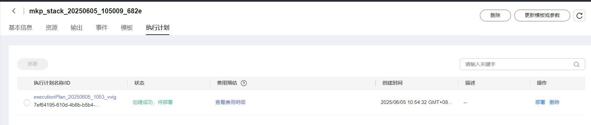

```markdown
# Open WebUI Platform
## Product Link
[Open WebUI Platform](https://marketplace.huaweicloud.com/intl/hidden/contents/7e175eb2-0ff6-4edc-a61a-9d8da860c293)

## Product Description
[Open WebUI Platform](https://github.com/open-webui/open-webui/) is an extensible, feature-rich, and user-friendly self-hosted AI platform designed to operate entirely offline. The platform supports various LLM inference frameworks (such as Ollama and OpenAI-compatible APIs) with a built-in RAG inference engine, making it a powerful AI deployment solution.<br>
This product is provided as a pre-installed image on Huawei Cloud's HCE2.0 system (Kunpeng architecture).

## Purchase Guide
You can search for "Open WebUI Platform" in the Cloud Marketplace.<br>
For region and specifications, use the recommended configurations. Choose between pay-as-you-go/monthly/annual billing based on your needs - pay-as-you-go for short-term use, monthly/annual for long-term use. Click "Buy Now" after confirming configurations.


### Direct Deployment Using RFS Template

After filling required fields, click Next


After creating deployment plan, click Confirm


Click Deploy to execute plan

"Apply required resource success" indicates successful creation


### ECS Console Configuration
#### Prerequisites

Before ECS console configuration, you need to configure **security group rules** in advance.

> **Security group rules configuration:**
> - Allow inbound port 3000, with source IP including your client IP (otherwise inaccessible)
> - Allow inbound port `22` for CloudShell connections (for console debugging)
> - Enable all outbound traffic

#### Creating ECS

After preparation, navigate to [ECS Purchase](https://support.huaweicloud.com/qs-ecs/ecs_01_0103.html) from ECS console. ECS resource configuration as shown:

Select CPU architecture

Select server specifications

Select image

Complete other parameters as needed, then click "Buy Now"


> **Important Notes:**
- You may create your own VPC
- Select the security group configured in [**Prerequisites**](#prerequisites);
- For Elastic IP, choose "Pay-by-traffic" (recommended) with 5Mbit/s bandwidth;
- Advanced configuration requires custom data injection, so select "Set later" for login credentials;
- Keep other settings as default or configure accordingly.

 ## Usage Guide
 
 ### Start Open WebUI on Server
```shell
# Check service status
docker ps
``` 
- **Container startup doesn't guarantee service availability** - continuously check until open-webui container status shows "healthy"<br>


 ### Access Open WebUI
Access via browser at http://Your_IP:3000 <br>


### Full operation reference see Open WebUI documentation
[Documentation](https://docs.openwebui.com/)
```
