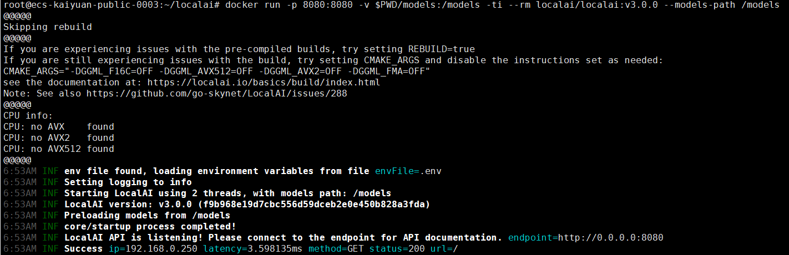

# Open WebUI平台
## 商品连接
[Open WebUI平台](https://marketplace.huaweicloud.com/hidden/contents/8ae48a35-d88c-48d9-9ca8-6e8f5e1ca2b2#productid=OFFI1151329161185636352)

## 商品说明
[Open WebUI平台](https://github.com/open-webui/open-webui/)是一个可扩展、功能丰富且用户友好的自托管AI平台，专为完全离线运行而设计。该平台支持多种LLM推理框架（如Ollama和OpenAI兼容API），并内置RAG推理引擎，是一款功能强大的AI部署解决方案。<br>
本商品在鲲鹏云的上HCE2.0系统中进行安装后以镜像提供给用户使用。

## 商品购买
您可以在云商店搜索“Open WebUI平台”。<br>
其中，地域、规格、按照推荐配置使用，购买方式根据您的需求选择按需/按月/按年，短期使用推荐按需，长期使用推荐按月/按年，确认配置后点击“立即购买”。



### 使用 RFS 模板直接部署

必填项填写后，点击 下一步


创建直接计划后，点击 确定


点击部署，执行计划

如下图“Apply required resource success. ”即为资源创建完成


### ECS控制台配置
#### 准备工作

在使用ECS控制台配置前，需要您提前配置好 **安全组规则**。

> **安全组规则的配置如下：**
> - 入方向规则放通端口3000，源地址内必须包含您的客户端ip，否则无法访问
> - 入方向规则放通 CloudShell 连接实例使用的端口 `22`，以便在控制台登录调试
> - 出方向规则一键放通

#### 创建ECS

前提工作准备好后，选择 ECS 控制台配置跳转到[购买ECS](https://support.huaweicloud.com/qs-ecs/ecs_01_0103.html) 页面，ECS 资源的配置如下图所示：

选择CPU架构

选择服务器规格

选择镜像

其他参数根据实际请客进行填写，填写完成之后，点击立即购买即可


> **值得注意的是：**
- VPC 您可以自行创建
- 安全组选择 [**准备工作**](#准备工作) 中配置的安全组；
- 弹性公网IP选择现在购买，推荐选择“按流量计费”，带宽大小可设置为5Mbit/s；
- 高级配置需要在高级选项支持注入自定义数据，所以登录凭证不能选择“密码”，选择创建后设置；
- 其余默认或按规则填写即可。

 ## 商品使用
 
 ### 登录服务器启动Open WebUI
```shell

# 启动
服务随系统自动启动。

# 查看服务状态
docker ps
``` 
- **容器启动不代表服务可用**，需要一直检查open-webui的容器状态直到为healthy<br>


 ### 登录Open WebUI
通过浏览器访问   http://Your_IP:3000  <br>
**创建管理员登录进去，可以探索模型聊天、笔记、知识库等众多功能，值得尝试**


### 完整操作参考Open WbUI文档
[文档](https://docs.openwebui.com/)
